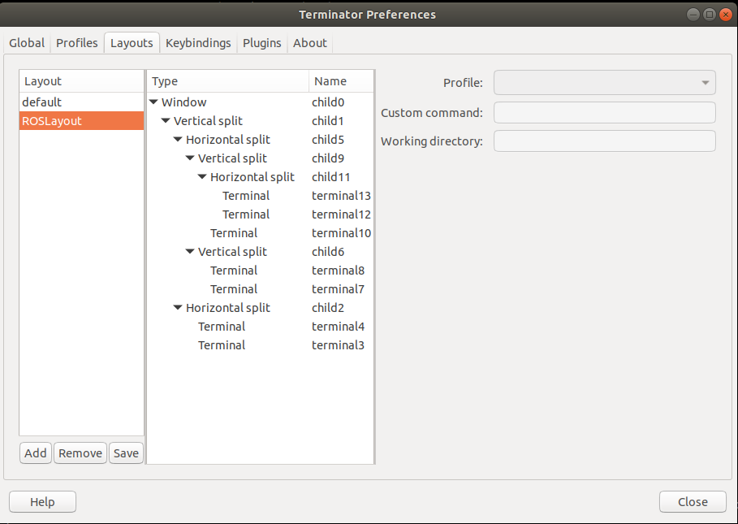

# Robot control

This repositories enable the execution of the human-to-robot handover state machine. 
The code is tested on **Ubuntu 20.04** with **ROS Noetic**.

---

## Table of Contents

1. [Prerequisites](#prerequisites)
2. [UR5](#ur5)
3. [Franka Robot](#franka)
4. [Robotiq-2F 85](#robotiq)
5. [Launching the control pipeline](#launching-the-control-pipeline)
6. [Docker container](#docker-container)
---

## Prerequisites

Before starting, ensure the following dependencies are installed:

- **MoveIt**: Follow the [Getting Started Guide](https://ros-planning.github.io/moveit_tutorials/doc/getting_started/getting_started.html) to install MoveIt.

- **Universal Robots ROS Driver**: Follow this [installation](https://github.com/UniversalRobots/Universal_Robots_ROS_Driver). 

Note that the following launch file `ur5_bringup.launch` within the `ur_robot_driver` package has been modified by adding the `joint_group_vel_controller` to the list of stopped controllers.
After cloning the repository, copy the content of the custom package from this repository into the respective cloned directory.

- **ROS-Industrial Universal Robot**: ROS-Industrial support for [Universal Robots](https://wiki.ros.org/universal_robot)  manipulators. 

This repository has been used in the following branch: `1.3.3`.
`git clone --branch 1.3.3 https://github.com/ros-industrial/universal_robot.git`

Note that the following packages `ur_description` and `ur5_moveit_config` have been modified to add specific functionality to the control code. Here's an overview of the key changes:

- The file `ur_macro_robotiq.xacro` was added to integrate the Robotiq gripper with the UR5 robot's kinematic model.
- Added the `vel_joint_traj_controller`.
- Added the file `ur5_robotiq.srdf` to incorporate the Robotiq gripper into the Semantic Robot Description Format (SRDF) of the UR5 robot.

After cloning the repository, copy the content of the custom packages from this repository into the respective cloned directory using the following commands:

**Download the custom packages:**

```bash
wget https://github.com/SIRSIIT/fast-handover/raw/main/handover_robot/universal_robot.tar.gz

cp -R  universal_robot 
```


**Extract the custom packages:**

```bash
tar -xzvf universal_robot.tar.gz
```

**Copy the custom packages into the respective directory:**


```bash
cp -R universal_robot/* /path/to/your/ros_workspace/src/universal_robot/
```


- **Robotiq-85 Gripper**: Install the Robotiq-85 ROS Driver from this [repo](https://github.com/jr-robotics/robotiq.git). Useful tutorials can be found on the [ROS wiki](https://wiki.ros.org/robotiq/Tutorials). 
Clone the ROS package providing a URDF model of the [Robotiq 2-Finger Adaptive Robot Gripper](https://github.com/a-price/robotiq_arg85_description.git).

Note that the file `robotiq_arg85.urdf.xacro` has been modified. Copy the content of the custom packages into the respective cloned directories, following the procedure explained above.


- **Franka ROS**: ROS integration for [Franka Robotics research robots](https://github.com/frankaemika/franka_ros.git). 
This repository has been used in the following branch: `0.9.1`.
`git clone --branch 0.9.1 https://github.com/frankaemika/franka_ros.git`

Note that the following packages `franka_control` has been modified to add `joint_group_vel_controller` to support real-time control using MoveIt Servo. After cloning the repository, copy the content of the custom packages from this repository into the respective cloned directory.


- **Franka Emika Panda MoveIt Config Package** Panda robot MoveIt integration from this [repo](https://github.com/moveit/panda_moveit_config.git)

This repository has been used in the following branch: `noetic-devel`.
`git clone --branch noetic-devel https://github.com/moveit/panda_moveit_config.git`

Note that the package has been modified. The controller `vel_joint_traj_controller` has been added to the controller list. After cloning the repository, copy the content of the custom packages from this repository into the respective cloned directory.


- **Additional ROS packages** 
This project depends on the following packages:
`combined-robot-hw`, `controller-interface`, `controller-manager`, `gazebo-dev`, `hardware-interface`, 
`industrial-robot-status-interface`, `joint-limits-interface`, `moveit-commander`, `moveit-planners-ompl`, 
`moveit-ros-visualization`, `moveit-ros-move-group`, `moveit-servo`, `moveit-simple-controller-manager`, 
`ompl`, `pass-through-controllers`, `pilz-industrial-motion-planner`, `realtime-tools`, `rviz`,
`scaled-joint-trajectory-controller`,`smach`,,`smach-msgs`,`smach-ros`,`soem`,`speed-scaling-interface`,
`speed-scaling-state-controller`,`tf`,`tf-conversions`,`tf2`,`tf2-eigen`,`tf2-geometry-msgs`,`tf2-kdl`,  
`tf2-msgs`,`tf2-py`,`tf2-ros`,`trac-ik-kinematics-plugin`,`transmission-interface`,`ur-client-library`,
`ur-robot-driver`,`ur-calibration`,`ur-msgs`,`vision-msgs`

- **System packages**
`build-essential`
`cmake`
`libpoco-dev`
`libeigen3-dev`
`libssl-dev`
`libcurl4-openssl-dev`
`libbenchmark-dev`
`dpkg-dev`
`fakeroot`
`libyaml-cpp-dev`
`python3-pip`
`python3-catkin-tools`
`python3-vcstool`

- **Python packages**
`pymodbus==2.5.3`
`pyserial-asyncio`


---

## UR5

### Calibration

Before starting, it is required to calibrate the UR robot.

### Extract calibration information
Each UR robot is calibrated inside the factory, giving exact forward and inverse kinematics. To also make use of this in ROS, you first have to extract the calibration information from the robot.

`roslaunch ur_calibration calibration_correction.launch \
  robot_ip:=<robot_ip> target_filename:="${HOME}/my_robot_calibration.yaml"`

Though this step is not necessary to control the robot using this driver, it is highly recommended to do so, as otherwise, end-effector positions might be off in the magnitude of centimetres.


### Setting up a UR robot for ur_robot_driver

**Prepare the robot**

For using the `ur_robot_driver` with a real robot you need to install the `externalcontrol-x.x.x.urcap` which can be found [here](https://github.com/UniversalRobots/Universal_Robots_ROS_Driver).

For installing the necessary URCap and creating a program, please see the individual tutorials on how to setup a CB3 robot or how to setup an e-Series robot.

### URCap installation

- **CB3 series**: https://github.com/UniversalRobots/Universal_Robots_ROS_Driver/blob/master/ur_robot_driver/doc/install_urcap_cb3.md

- **e-Series**: https://github.com/UniversalRobots/Universal_Robots_ROS_Driver/blob/master/ur_robot_driver/doc/install_urcap_e_series.md

To setup the tool communication on an e-Series robot, please consider the tool communication setup guide.

---

## Franka 

### **libfranka**
Install or compile libfranka for [Linux](https://frankaemika.github.io/docs/installation_linux.html).
This repository has been used in the following branch: `0.9.2`.

`git clone --branch 0.9.2 --depth 1 https://github.com/frankaemika/libfranka.git`

---

## Robotiq-85 2F

### Setting up a Robotiq-85 Gripper.

In our pipeline, we control the Robotiq gripper by connecting it to a PC using a USB to RS-485 converter. Manage the gripper with MODBUS commands as described in this [Robotiq tutorial](https://wiki.ros.org/robotiq/Tutorials/Control%20of%20a%202-Finger%20Gripper%20using%20the%20Modbus%20RTU%20protocol%20%28ros%20kinetic%20and%20newer%20releases%29).

---

## Launching the control pipeline

1. Launch **Handover MoveIt Control** node.

If you use a **UR5** robot:

```bash
roslaunch handover_moveit_ctrl ur5.launch robot_ip:=<robot_ip>
```

If you use a **Panda** robot:

```bash
roslaunch handover_moveit_ctrl panda.launch robot_ip:=<robot_ip>
```

2. Start the **Servo Control** node:

For **UR5**:

```bash
roslaunch servo_ctrl servo.launch ur5:=true
```

For **Panda**:

```bash
roslaunch servo_ctrl servo.launch panda:=true
```

3. Start the Robotiq gripper control node (only if you are using a UR5).

```bash
sudo chmod 777 /dev/ttyUSB0

  rosrun robotiq_2f_gripper_control Robotiq2FGripperRtuNode.py /dev/ttyUSB0
```

```bash
  rosrun robotiq_2f_gripper_control Robotiq2FGripperSimpleController.py
``` 


4. Start the state machine action servers for joint, pose and gripper control.

For **UR5**:

```bash
rosrun smach_handover_ctrl controller_server.py _robot:=ur5
```

For **Panda**:

```bash
rosrun smach_handover_ctrl controller_server.py _robot:=panda
```


5. Run the SMACH state machine to start the handover process.

For **UR5**:

```bash
rosrun smach_handover_ctrl planner.py _robot:=ur5
```

For **Panda**:


```bash
rosrun smach_handover_ctrl planner.py _robot:=panda
```

---

## Docker container
 
You can easily run the commands and set up the environment using Docker, making it a plug-and-play solution for the project. All dependencies and configurations are automatically set up. 


1. Install [Docker](https://docs.docker.com/engine/install/ubuntu/#install-using-the-repository) and set it up so that it does not require sudo permissions following this [guide](https://docs.docker.com/engine/install/linux-postinstall/)

2. Build the [Dockerfile](https://github.com/SIRSIIT/fast_handover/blob/main/Dockerfile):

```bash
    docker build -t ros_noetic:handover_robot    
```

3. Run the container:

   ```bash
     docker run -it --privileged -v ~/workspace:/home/workspace/shared --net=host --cap-add SYS_NICE --env='QT_X11_NO_MITSHM=1' --volume='/tmp/.X11-unix:/tmp/.X11-unix:rw' -e DISPLAY=unix${DISPLAY} --device /dev/dri/card0:/dev/dri/card0 -id ros_noetic:handover_robot
    ```

4. Open 5 `bash` sessions

```bash
  CONTAINER_ID=$(docker ps -lq)

  docker exec -it $CONTAINER_ID bash"
```

In each terminal, run the commands listed [above](#launching-the-control-pipeline).

To kill all the processes, execute the `kill_all.sh` script. 
Before running the script, ensure that it has executable permissions:

```bash
chmod +x kill_all.sh
```

### Automate Terminal Setup with `handover_run.sh` Script

To simplify the process of launching the Docker container and opening 5 terminal sessions in [Terminator](https://github.com/gnome-terminator) with the desired layout, use the provided `handover_run.sh` script. 

Steps to use handover_run.sh:

1. Make the script executable:

```bash
chmod +x handover_run.sh
```

2. In Terminator, go to **Preferences** and navigate to the **Layouts** tab. 


3. Create a new Layout. Click **Add** and name it **ROSLayout** (or any other name you prefer).


4. Configure the Layout. Set up your layout with the required splits and terminal arrangement as shown in the figure below.

  

5. Once the layout is configured, save it by clicking **Save**.

6. Install [xdotool](https://pypi.org/project/xdotool/).

7. Run the script:

Execute the script to build the Docker container, run it, and open Terminator with the correct layout:

```bash
./handover_run.sh
```
